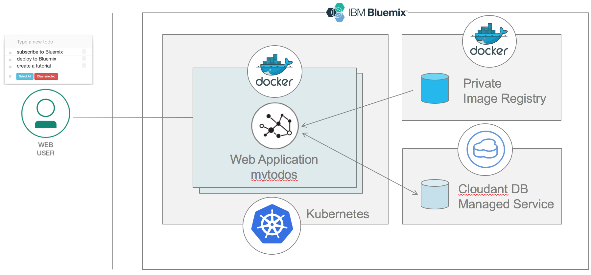
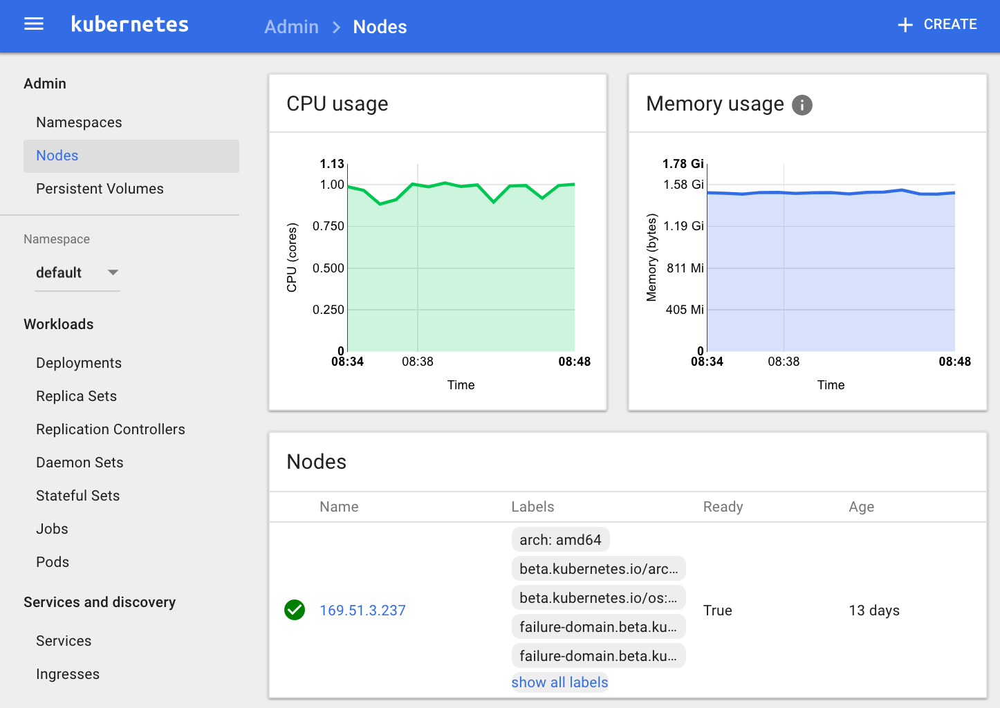
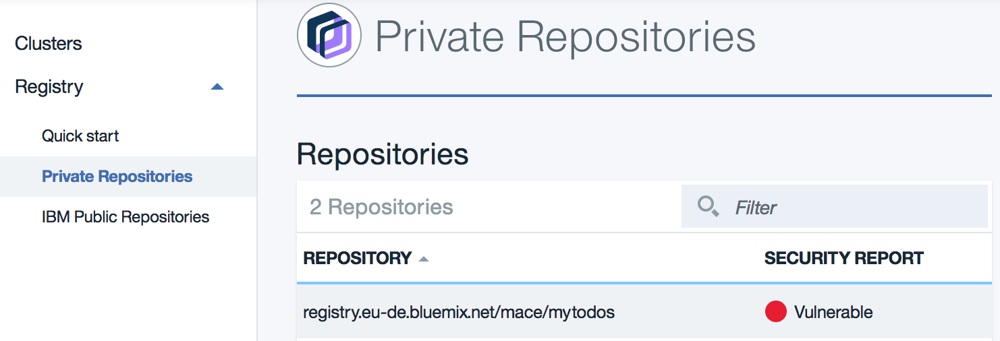
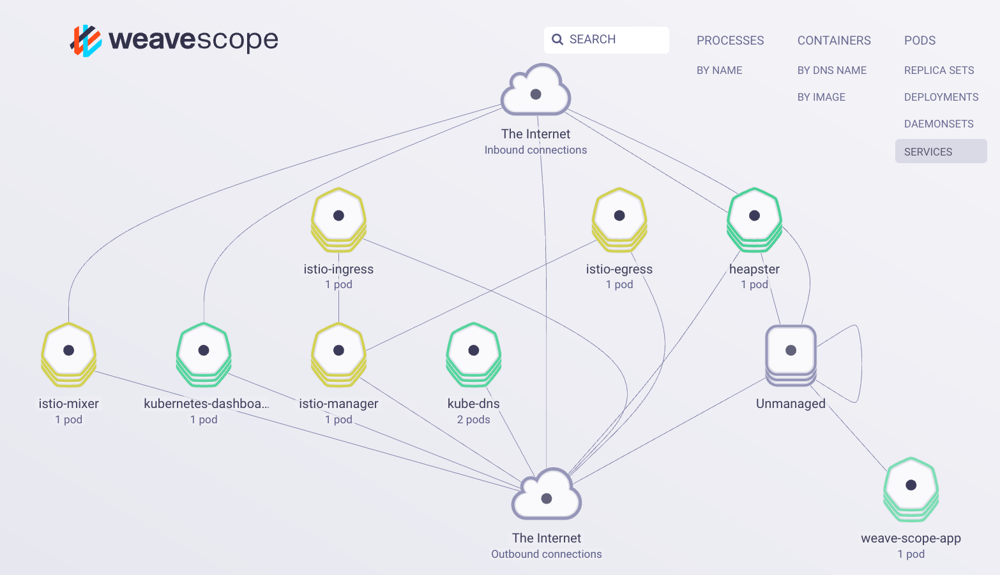

# Introduction

In this lab, you’ll gain a high level understanding of the Kubernetes architecture, features, and development concepts related to the IBM Container Service. Throughout the lab, you’ll get a chance to use the Command Line Interface (CLI) for creating a Kubernetes cluster, manage your running cluster, and bind a service.



This lab shows how to demonstrate the deployment of a web application for managing todos. The front end is written in Angular and the reminders are being stored in a Cloudant NoSQL dababase. All run on Node.js, in Docker container managed by Kubernetes.

# Pre-Requisites

+ Get a [Bluemix IBM id](https://bluemix.net)
+ Install the [Bluemix CLI](http://clis.ng.bluemix.net)
+ Install docker for [Mac](https://docs.docker.com/engine/installation/mac/) or [Windows](https://docs.docker.com/engine/installation/windows/)
+ Install [Kubectl](https://kubernetes.io/docs/user-guide/prereqs/)
+ Install a [Git client](https://git-scm.com/downloads)
+ Install [Node.js](https://nodejs.org)


# Steps

1. [Install Bluemix Container Service and Registry plugins](#step-1---install-bluemix-container-service-and-registry-plugins)
1. [Connect to Bluemix](#step-2---connect-to-bluemix)
1. [Create a cluster](#step-3---create-a-cluster)
1. [Access the cluster via Kubernetes CLI and Dashboard](#step-4---access-the-cluster-via-kubernetes-cli-and-dashboard)
1. [Get and build the application code](#step-5---get-and-build-the-application-code)
1. [Build and Push the application container](#step-6---build-and-push-the-application-container)
1. [Bind a Bluemix service to a Kubernetes namespace](#step-7---bind-a-bluemix-service-to-a-kubernetes-namespace)
1. [Create Kubernetes Services and Deployments](#step-8---create-kubernetes-services-and-deployments)
1. [Monitor your container with Weave Scope](#step-9---monitor-your-container-with-weave-scope)
1. [Scale and Clean your services](#step-10---scale-and-clean-your-services)
1. [Issues when pushing to the container registry registry](#step-11---issues-when-pushing-to-the-container-registry)

# Step 1 - Install Bluemix Container Service and Registry plugins

To create Kubernetes clusters, and manage worker nodes, install the Container Service plug-in.

1. Open a command line utility.

1. Before installing the container plugin, we need to add the repository hosting Bluemix CLI plug-ins.
    ```
    bx plugin repos
    ```
    Output:
    ```
    Listing added plug-in repositories...

    Repo Name   URL
    Bluemix     https://plugins.ng.bluemix.net
    ```

1. If you don't see a repository Bluemix, run the following command:
    ```
    bx plugin repo-add Bluemix https://plugins.ng.bluemix.net
    ```

1. To install the Container Service plugin, run the following command:
    ```
    bx plugin install container-service -r Bluemix
    ```

1. To manage a private image registry, install the Registry plug-in. This plug-in connects to a private image registry Bluemix, where you can store images that can be used to build containers. The prefix for running registry commands is **bx cr**.
    ```
    bx plugin install container-registry -r Bluemix
    ```

1. To verify that the plug-in is installed properly, run the following command:
    ```
    bx plugin list
    ```
    and both plug-ins are displayed in the results:
    ```
    Listing installed plug-ins...

    Plugin Name          Version
    container-registry   0.1.104
    container-service    0.1.219
    ```
1. To update the container registry plugin
    ```
    bx plugin update container-registry -r Bluemix
    ```

# Step 2 - Connect to Bluemix

1. Login to Bluemix
    ```
    bx login -a https://api.ng.bluemix.net
    ```

1. Log in to the IBM Bluemix Container Service Kubernetes plug-in. The prefix for running commands by using the IBM Bluemix Container Service plug-in is **bx cs**.
    ```
    bx cs init
    ```

# Step 3 - Create a cluster
To create a cluster, you have two options either a Lite cluster or a Standard one.

+ A **Lite cluster** is a free cluster comes with a single worker node to deploy container pods upon. A worker node is the compute host, typically a virtual machine, that your apps run on. Go to Step 3.1 *Create a Lite cluster*

+ A **Standard cluster** is a production-ready cluster with as many worker nodes as you want. A Standard cluster requires requires a Bluemix Infrastructure (SoftLayer) account. Go to Step 3.2 *Create a Standard cluster*.

## Step 3.1 - Create a Lite cluster

1. Create your Lite cluster.
    ```
    bx cs cluster-create --name <your-cluster-name>
    ```
    Once the cluster reaches the **deployed** state you can provision pods, but they will be enqueued until the cluster’s pods are finished provisioning. Note that it takes up to 15 minutes for the worker node machine to be ordered and for the cluster to be set up and provisioned.

1. Verify that the creation of the cluster was requested.
    ```
    bx cs clusters
    ```

1. Check the status of the worker node(s).
    ```
    bx cs workers <cluster_name_or_id>
    ```


## Step 3.2 - Create a Standard cluster

1. Set Infrastructure credentials
    ```
    bx cs credentials-set --infrastructure-username <YOUR-USER-NAME> --infrastructure-api-key <YOUR-API-KEY>
    ```

1. Review the data centers that are available.
    ```
    bx cs locations
    ```
    Output for US South:
    ```
    dal10
    dal12
    ```

1. Review the machine types available in the data center
    ```
    bx cs machine-types <datacenter>
    ```
    Output:
    ```
    bx cs machine-types dal10
    Getting machine types list...
    OK
    Machine Types
    Name         Cores   Memory   Network Speed   OS             Storage   Server Type   
    u1c.2x4      2       4GB      100Mbps         UBUNTU_16_64   100GB     virtual
    b1c.4x16     4       16GB     1000Mbps        UBUNTU_16_64   100GB     virtual
    b1c.16x64    16      64GB     1000Mbps        UBUNTU_16_64   100GB     virtual
    b1c.32x128   32      128GB    1000Mbps        UBUNTU_16_64   100GB     virtual
    b1c.56x242   56      242GB    1000Mbps        UBUNTU_16_64   100GB     virtual
    ```

1. Get the available VLANs in your account
    ```
    bx cs vlans <datacenter>
    ```
    Output:
    ```
    Getting VLAN list...
    OK
    ID        Name   Number   Type      Router
    1556821          1860     private   bcr01a.dal10
    1556815          1626     public    fcr01a.dal10
    ```
    Note: When you create a Kube cluster with no vlans in create command, those should get created for you.

1. Create cluster
    ```
    bx cs cluster-create \
      --name <cluster-name> \
      --location dal10 \
      --workers <number-of-workers> \
      --machine-type <machine-type> \
      --hardware shared \
      --public-vlan <public-vlan-id> \
      --private-vlan <private-vlan-id>
    ```
    For example:
    ```
    bx cs cluster-create \
      --name my-cluster \
      --location dal10 \
      --workers 3 \
      --machine-type b1c.4x16 \
      --hardware shared \
      --public-vlan 1556815 \
      --private-vlan 1556821
    ```

1. Verify that the creation of the cluster was requested.
    ```
    bx cs clusters
    ```

1. Check the status of the worker node(s).
    ```
    bx cs workers <cluster_name_or_id>
    ```

# Step 4 - Access the cluster via Kubernetes CLI and Dashboard

1. You will need the kubeconfig data and certs to connect to your cluster using kubectl. You can download the config to your local machine via the CLI. Issue the following command to download your kubeconfig for a given cluster.
    ```
    bx cs cluster-config <cluster_name_or_id>
    ```

1. Use the result of the previous command to set the path to your Kubernetes configuration file as an environment variable.
    For Mac: ```export KUBECONFIG=/Users/ibm/.bluemix/plugins...```
    For Win: ```set KUBECONFIG=/Users/ibm/.bluemix/plugins...```

1. Access your Kubernetes dashboard with the default port 8001.
    ```
    kubectl proxy
    Starting to serve on 127.0.0.1:8001
    ```
1. Open the Kubernetes dashboard: <a href="http://localhost:8001/ui" target="_blank">http://localhost:8001/ui</a>

    


# Step 5 - Get and build the application code

1. Clone or download the source code for the Todo web app.
    ```
    git clone https://github.com/lionelmace/mytodo
    ```
    This command creates a directory of your project locally on your disk.

1. Change to the directory of the checkout
    ```
    cd mytodo
    ```

1. Get the node.js dependencies for this project
    ```
    npm install
    ```

# Step 6 - Build and Push the application container

1. Log in to the private Container Registry of Bluemix. Only required if you haven't `bx login` before.
    ```
    bx cr login
    ```
    `bx cr login` is a wrapper for `docker login` , it is only needed to log your local docker daemon into the registry, which enables you to push/pull images.

1. To create the namespace of your image registry
    ```
    bx cr namespace-add <YOUR-NAMESPACE-NAME>
    ```

1. If you forgot the namespace for your image registry, run the command.
    ```
    bx cr namespace-list
    ```

1. Build a Docker image that includes the app files of the directory.
    ```
    docker build -t registry.ng.bluemix.net/<namespace>/mytodos:v1 .
    ```

    Note: If you already have an image, just need to tag this image before pushing it.
    ```
    docker tag mytodos:v1 registry.ng.bluemix.net/<namespace>/mytodos:v1
    ```

1. Push the image to your private images registry.
    ```
    docker push registry.ng.bluemix.net/<namespace>/mytodos:v1
    ```

1. Verify that the image was successfully added to your registry.
    ```
    bx cr images
    ```
    Output:
    ```
    Listing images...

    REPOSITORY                                  NAMESPACE   TAG       DIGEST         CREATED        SIZE     VULNERABILITY STATUS
    registry.ng.bluemix.net/your-namespace/mytodos   namespace   1   0d90cb732881   1 minute ago   264 MB   OK
    ```
1. The image is also visible in the Bluemix Console. To view it, go to the catalog, select the service *Container Registry*. Click on Private Repositories




# Step 7 - Bind a Bluemix service to a Kubernetes namespace

This web application uses a Cloudant DBaaS to store the todo task.

1. See all the available services in the catalog
    ```
    bx service offerings
    ```

1. Create an instance of a service
    ```
    bx service create <service_name> <service_plan> <service_instance_name>
    ```
    Example:
    ```
    bx service create cloudantNoSQLDB Lite todo-cloudant
    ```

1. Verify you created your service
    ```
    bx service list
    ```

1. Find your Kubernetes namespace you will need in the next step.
    ```
    kubectl get namespaces
    ```
    Output:
    ```
    NAME          STATUS    AGE
    default       Active    7d
    ibm-system    Active    7d
    kube-system   Active    7d
    ```

1. Bind your service to your Kubernetes namespace
    ```
    bx cs cluster-service-bind <cluster_id> <kube_namespace> <service_instance_name>
    ```
    Example:
    ```
    bx cs cluster-service-bind ad35aacc139b4e11a6f3182fb13d24af default todo-cloudant
    ```
    Note: Use the namepsace **default** or create your own namespace.

1. Control that your secret was successfully created
    ```
    kubectl get secrets
    ```


# Step 8 - Create Kubernetes Services and Deployments

1. Edit the YAML file `deploy2kubernetes.yml` to set the namespace of your private registry. If you don't remember this namespace, run the following command:
    ```
    bx cr namespace-list
    ```

    Your YAML file should look as follows:
    ```yml
    ---
    # Service to expose frontend
    apiVersion: v1
    kind: Service
    metadata:
      name: mytodos
      labels:
        app: mytodos
        tier: frontend
    spec:
      # if your cluster supports it, uncomment the following to automatically create
      # an external load-balanced IP for the frontend service.
      # type: LoadBalancer
      type: NodePort
      ports:
      - port: 8080
        nodePort: 31513
      selector:
        app: mytodos
        tier: frontend
    ---
    # Application to deploy
    apiVersion: extensions/v1beta1
    kind: Deployment
    metadata:
      name: mytodos
    spec:
      replicas: 2 # tells deployment to run 2 pods matching the template
      template: # create pods using pod definition in this template
        metadata:
          labels:
            app: mytodos
            tier: frontend
        spec:
          containers:
          - name: mytodos
            image: registry.ng.bluemix.net/<your-namespace>/mytodos:v1
            imagePullPolicy: Always
            resources:
              requests:
                cpu: 100m
                memory: 100Mi
            volumeMounts:
              - mountPath: /opt/service-bind # Mount the "service-bind-volume" volume into the pod.
                name: service-bind-volume
          volumes:
            - name: service-bind-volume
              secret:
                defaultMode: 420
                secretName: binding-todo-cloudant
    ```
    Note: The secret name is the contatenation of **binding-** and the service name.

1. Deploy the app to a pod in your Kubernetes cluster.
    ```
    kubectl create -f deploy2kubernetes.yml

    service "mytodos" created
    deployment "mytodos" created    
    ```
    This command will make the app accessible to the world by exposing the deployment as a NodePort service.

1. To test your app in a browser, get the details to form the URL.
    ```
    kubectl describe service mytodos
    ```
    Output:
    ```
    Name:			mytodos
    Namespace:		default
    Labels:			app=mytodos
    			tier=frontend
    Selector:		app=mytodos,tier=frontend
    Type:			NodePort
    IP:			10.10.10.205
    Port:			<unset>	3000/TCP
    NodePort:		<unset>	31513/TCP
    Endpoints:		172.30.51.102:3000,172.30.51.103:3000
    Session Affinity:	None
    No events.
    ```
    > The NodePorts are randomly assigned when they are generated with the expose command, but within 30000-32767. In this example, the NodePort is 31513.

1. Get the public IP of the worker node in the cluster by running one of the command

    ```
    kubectl get nodes
    NAME             STATUS    AGE
    169.47.227.138   Ready     23h
    ```
    OR
    ```
    bx cs workers <cluster_name_or_id>
    Listing cluster workers...
    OK
    ID                                            Public IP        Private IP      Machine Type   State      Status
    dal10-pa10c8f571c84d4ac3b52acbf50fd11788-w1   169.47.227.138   10.171.53.188   free           deployed   Deploy Automation Successful
    ```

1. Open a browser and check out the app with the following URL:
    ```
    http://<IP_address>:<NodePort>
    ```
    In this example, the url would be ```http://169.47.227.138:31513```


# Step 9 - Monitor your container with Weave Scope

[Weave scope](https://www.weave.works/docs/scope/latest/introducing/) provides a visual diagram of your resources within the kube cluster including services, pods, containers, processes, nodes, etc. Scope provides you interactive metrics for CPU and Memory and provides tools to tail and exec into a container. Scope is a powerful tool that you do not want to expose on the public internet.



To use weave scope securely with your Kubernetes cluster you can follow these steps.

1. Update the Role Based Access Control
    ```
    kubectl apply -f "https://gist.githubusercontent.com/dcberg/0ae9b50cb2a94a18dc69c80dbb7c4d60/raw/e23a1bbbad877499f0e817f519176bf5e1e4aae9/weave-scope-rbac-alpha.yaml"
    ```

1. Deploy weave scope service (privately accessible via cluster IP).
    ```
    kubectl apply --namespace kube-system -f "https://cloud.weave.works/k8s/scope.yaml?k8s-version=$(kubectl version | base64 | tr -d '\n')"
    ```

1. Run a port forward:
    ```
    kubectl port-forward -n kube-system "$(kubectl get -n kube-system pod --selector=weave-scope-component=app -o jsonpath='{.items..metadata.name}')" 4040
    ```

1. Open your web browser to
    <a href="http://localhost:4040" target="_blank">http://localhost:4040</a>

    Note: Weave Scope is a cpu heavy (especially the app). Scope is best utilized in a large cluster.


# Step 10 - Scale and Clean your services

1. Let's scale up to 3 replicas
    ```
    kubectl scale --replicas=3 deployment/mytodos
    ```

1. Then, inspect our Pods again.
    ```
    kubectl get pods
    ```

1. Finally, delete your deployment
    ```
    kubectl delete -f deploy2kubernetes.yml
    ```

# Step 11 - Issues when pushing to the container registry

Below is a list of issues you may face when pushing your images into the container registry.

1. Error: Request access to the resource is denied

    ```
    denied: requested access to the resource is denied
    ```
    Note that adding a namespace only affects one region - if you want the same namespace in multiple regions you need to target each region and add it in each one. Make sure the namespace you trying to push the image to, exist.

1. Error: You have exceeded your storage quota

    ```
    unauthorized: You have exceeded your storage quota. Delete one or more images, or review your storage quota and pricing plan
    ```
    Check the current quota:
    ```
    bx cr quota
    Getting quotas and usage for the current month, for account 'IBM'...

    QUOTA          LIMIT    USED     ADDITIONAL INFORMATION
    Pull traffic   5.0 GB   0 B
    Storage        512 MB   546 MB   Your account has exceeded its storage quota. Delete one or more images, or review your storage quota and pricing plan.
    ```
    Check the current plan:
    ```
    bx cr plan
    Getting pricing plan for account 'Lionel Mace's Account'...

    You are on the 'Free' pricing plan.
    ```
    You increase your quota you will need to upgrade plan:
    ```
    bx cr plan-upgrade standard
    ```
    Agree to the new pricing plan.

    ```
    Finally, you will increase the quota or just set to Unlimited
    ```
    bx cr quota-set --storage unlimited
    ```


# Resources

For additional resources pay close attention to the following:

- [Running Kubernetes clusters with IBM Bluemix Container Service](https://console.ng.bluemix.net/docs/containers/cs_cluster.html#cs_cluster_cli)
- [Container Service Swagger API](https://us-south.containers.bluemix.net/swagger)
- [Bash script to tail Kubernetes logs from multiple pods at the same time](https://github.com/johanhaleby/kubetail)
- [Bluemix CLI Plug-in Repository](http://clis.ng.bluemix.net/ui/repository.html#bluemix-plugins)
- [How to deploy, manage, and secure your container-based workloads](https://www.ibm.com/blogs/bluemix/2017/05/kubernetes-and-bluemix-container-based-workloads-part1/)
- [Deploy MicroProfile based Java microservices on Kubernetes Cluster](https://github.com/IBM/Java-MicroProfile-on-Kubernetes)
