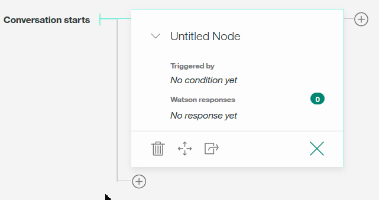
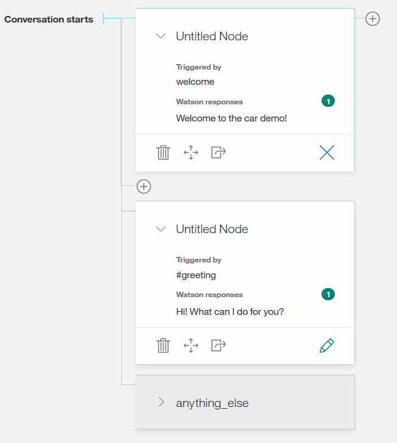
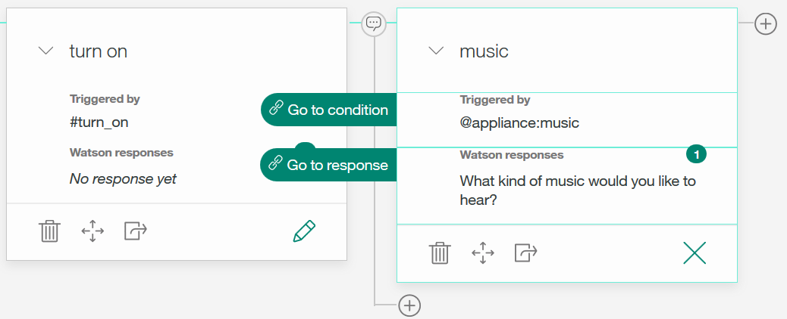
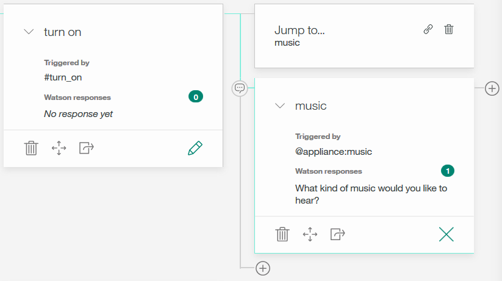

# Introduction

With the Watson Conversation service you can create virtual agents and bots that combine machine learning, natural language understanding, and integrated dialog tools to provide automated customer engagements.

The following image illustrates many uses for the Conversation service.

  

In this lab, you go through a step-by-step process to create your first dialog flow thanks to the easy-to-use graphical environment.


# Objective

In the following lab, you will learn:

+ How to train Watson to understand your users' input with intents and examples
+ How to identify the terms that may vary in your users' input
+ How to create the responses to your user's questions: Dialog Builder
+ How to test and improve your dialog


# Pre-Requisites

+ Get a [Bluemix IBM id](https://bluemix.net)
+ Install the [Bluemix CLI](http://clis.ng.bluemix.net)
+ Install [Node.js](https://nodejs.org) if you plan to integrate the dialog into a webapp.


# Steps

1. [Create a Watson Conversation service](#step-1---create-a-watson-conversation-service)
1. [Create your workspace](#step-2---create-your-workspace)
1. [Work with intents and examples](#step-3---work-with-intents-and-examples)
1. [Work with entities](#step-4---work-with-entities)
1. [Create a dialog](#step-5---create-a-dialog)
1. [Integrate the dialog into a web app](#step-6---integrate-the-dialog-into-a-web-app)


# Step 1 - Create a Watson Conversation service

1. On the Bluemix dashboard, select **Catalog** from the menu bar.

1. In the **Services** category, select **Watson**.

1. Click the icon for the Watson Conversation service. The Add Service page opens.

1. Keep the default options, including the free plan and click Create. The service instance is created, and the service dashboard page opens automatically.

1. On the dashboard page, click on the **Launch Tool** to get started. The "Create workspace" page opens.


# Step 2 - Create your workspace

One workspace corresponds to one bot — it contains all the configuration information that gives your bot its unique personality. A workspace is a container for all the artifacts that define the behavior of your service.

1. On the "Create workspace" page, click Create.

1. In the **Name** field, type ```Car tutorial```.

1. Choose **English (U.S.)** from one of eleven languages currently supported.

1. Select **Create**. The new workspace is created and appears as a tile on your dashboard.


# Step 3 - Work with intents and examples

The first thing you’ll see when you open your new workspace is the intents tab. Intents are things that the chat users are looking to do: change passwords, get status updates, make complaints, etc.

What’s really neat about managing intents is that you are actually training the system to understand what is needed without depending on the exact words. You give multiple training examples that correspond to specific actions or requests.

Creating new intents is easy.

1. On the Workspaces page, click the **Car tutorial** workspace tile. The workspace page opens to the Intents tab.

1. On the Intents tab, click **Create**.

1. In the **Intent name** field, type ```turn_on```. This intent will be used to indicate that the user wants to turn on an appliance such as the radio, windshield wipers, or headlights.

1. Add example utterances that will help Watson recognize the #turn_on intent:

1. In the **User example** field, type ```I need lights``` and press Enter. The example utterance ```I need lights``` is added to the intent.

1. Repeat the same process to add the following examples:
    ```
    + Listen to some music
    + Play some tunes
    + Air on please
    + Turn on the headlights
    ```

1. Now that you have added at least 5 examples, click **Create**. The intent is created and appears on the Intents page.

1. Repeat the same process to create a ```#greeting``` intent.
    ```
    + Hello
    + Hi
    + Good morning
    + Good afternoon
    + Good everning
    ```

**Results**

You defined two intents, ```#turn_on``` and ```#greeting```, with example utterances. These examples help train Watson to recognize these intents in user input.


# Step 4 - Work with entities

Entities are the specific pieces of information we want to extract from the user response. You’ll want to group entities that might trigger a similar response in your dialog. Each value can have multiple synonyms, which define different ways that the same value might be specified in user input. When the user's input is received, both intents and entities are identified, and you can use them in the corresponding dialog flow to choose the right response.

Create entities to represent what the user wants to turn on:

1. On the **Car tutorial** workspace page, click the Entities tab.

1. On the Entities tab, click **Create**.

1. In the **Entity** field, type ```appliance```. The @appliance entity represents an appliance in the car that a user might want to turn on.

1. Define a value for the @appliance entity:

1. In the **Value** field, type ```music```. This value represents a specific appliance that users might want to turn on.

1. In the **Synonyms** field, type ```radio```. This indicates that ```radio``` is another way of specifying the same value for the @appliance entity.

1. Click the plus sign (+) to define additional values for @appliance:

    + Value: ```headlights```. Synonym: ```lights```
    + Value: ```air conditioning```. Synonym: ```air```

1. Click **Create**. The @appliance entity is created now appears on the Entities tab.

1. On the Entities tab, click **Create** to create another entity.

1. Repeat the process to create the ```@genre``` entity with 3 values and synonyms:

    + Value: ```classical```. Synonym: ```symphonic```
    + Value: ```rhythm and blues```. Synonym: ```r&b```
    + Value: ```rock```. Synonym: ```pop```

**Results**

You defined two entities: ```@appliance``` (representing an appliance the can turn on) and ```@genre``` (representing a genre of music the user can choose).

When the user's input is received, the Conversation service identifies both the intents and entities. You can now define a dialog that uses intents and entities to choose the correct response.


# Step 5 - Create a dialog

A dialog is a set of conversational nodes that are contained in a workspace. Together the set of nodes makes a dialog tree, on which every branch is a conversation that can be had with a user.

First we need to create a starting node for the dialog:

1. On the **Car tutorial** workspace page, select the Dialog tab.

1. Click **Create**. The dialog is created with a single root node:

    

    The edit view of the node is also displayed. This is where you modify the node.

    

1. In the edit view, specify the condition and response for the starting node of the conversation:

1. In the **Trigger** field, start typing welcome.

1. Select **welcome (create new condition)** from the list. This node is triggered at the beginning of the conversation.

    When you create the condition in your first dialog node, a node with the condition anything_else is created in the dialog tree. We'll look at this node soon.

1. Add the first response from your bot in the **Watson responses**  field:
    ```Welcome to the car demo!```

    Your bot will issue this response when the specified condition is true (in this case, when the conversation starts).

1. Select the anything_else node that was created when you defined the conversation_start node.

    The edit view now shows the anything_else node rather than the welcome node.

1. Add a response in the **Watson responses** field of the anything_else node:
    ```I'm sorry, I don't understand. Please try again.```

    Your bot will issue this response when the user input doesn't match any other node.

1. Test the initial conversation:

  1. Click the Try it out  icon. In the chat pane, you should see the response ```Welcome to the car demo```.

  1. Type anything and press Enter. Because you have not yet defined any other nodes, you should see the response ```I'm sorry, I don't understand. Please try again.```

  1. Close the chat pane.


Now we can create dialog branches that handle the defined intents.

Create a dialog branch to respond to the #greeting intent. This intent requires only a simple response, so the branch can consist of only a single node.

1. Select the **welcome** node.

1. Select the + icon on the bottom of the node to create a root-level node. Because this new node is a peer of the welcome node (rather than a child node), it represents an alternative conversation. The edit view is opened for the new node.

1. In the **Triggered by** field, start typing ```#greeting```.

1. Select **#greeting (create new condition)** from the list. This condition is triggered by any input that matches the #greeting intent.

1. Add a response in the Watson responses field:
  ```Hi! What can I do for you?```

1. In the ```anything_else node```, select the minimize icon. This unclutters the tree view by minimizing this node. Here is the tree view now:

    

**Test the first intent branch:**

1. Select the  icon to open the chat pane.

1. Type ```Hello``` and press Enter. The output shows that the #greeting intent is recognized, and the appropriate response appears.

    

    The output shows that the #greeting intent is recognized, and the appropriate response appears.


**Add a root-level node for #turn_on**

Create another dialog branch to respond to the #turn_on intent.

Because there are multiple possibilities for what the user might want to turn on, this branch requires multiple nodes to represent a more complex conversation.

Start by creating the root-level node:

  1. Click the **+** icon on the bottom of the ```#greeting``` node to create a root-level node.  If the + icon isn't visible, select the #greeting node to put it into focus.

  1. In the **Name this node** field, enter ```turn on```. The title does not affect the processing of the node, but it makes it easier to find.

  1. In the edit view, in the **Triggered by** field, start typing ```#turn_on```.

  1. Select **#turn_on** from the list. This condition is triggered by any input that matches the #turn_on intent.

  1. Do not enter a response in this node.

The #turn_on intent requires additional processing, because the dialog needs to determine what appliance the user wants to turn on. To handle this, we create multiple responses based on additional conditions. There are three possible scenarios, based on the intents and entities that we have defined:

    + The user wants to turn on the music, in which case we need to ask for the genre.
    + The user wants to turn on any other valid appliance, in which case we simply echo the name of the requested appliance in a message that indicates that we're turning it on.
    + The user does not specify a recognizable appliance name, in which case we need to ask for clarification.

We'll check the conditions in this order. Determining the most efficient order in which to check conditions is an important skill in building dialog trees. If you find a branch is becoming very complex, check the conditions to see whether you can simplify your dialog by reordering them. It's often best to process the most specific conditions first.

To check the input, add a child node:

1. Select the + icon on the side of the ```turn on``` node to create a child node.

1. In the **Name this node** field, enter ```music```.

1. Under **Triggered by**, enter ```@appliance:music```. This condition is true if the value of the @appliance entity is music or one of its synonyms, as defined on the Entities tab.

1. Under ```Watson responses```, enter ```What kind of music would you like to hear?```

1. Exit the edit view of this node.


We want to jump directly from the turn on node to the music node without asking for any more user input. To do this, we use a Jump to action.

1. In the turn_on node, select the Jump to icon .

1. Select the ```music``` node, and then select **Go to condition**. We want to process the condition of the ```music``` node.

  

  Note that you had to create the target node (the node to which you want to jump) before you added the Jump to action.

  After you select Go to condition you see a new box in the tree:

  

Now we need a node to process the type of music that the user requests.

1. Select the **+** icon on the right side of the ```music``` node to create a child node. This child node is evaluated only after the user has responded to the question about the type of music. Because we need a user input before this node, there is no need to use a **Jump to** action.

1. Under **Triggered by**, enter ```@genre```. This condition is true whenever a valid value for the @genre entity is detected.

1. Under **Watson responses**, enter ```OK! Playing @genre```. This response uses the value that the user entered.


We also need a node to respond when the user does not specify a recognized value for @genre.

1. Select the **+** icon on the bottom of the ```genre``` node to create a peer node.

1. Under **Triggered by**, enter ```true```. This condition specifies that if the dialog flow reaches this node, it should always evaluate as true. (If the user specifies a valid @genre value, this node will never be reached.)

1. Under **Watson responses**, enter ```I'm sorry, I don't understand. I can play classical, rhythm and blues, or rock music.```

  


That takes care of all the cases where the user asked us to turn on the music.

**Test the dialog for music**

1. Select the  icon to open the chat pane.

1. Type ```Play music```. The bot recognizes the #turn_on intent and the @appliance:music entity, and it responds by asking for a musical genre.

1. Type the name or a synonym for a valid @genre value (for example, ```pop```). The bot recognizes the @genre entity and responds appropriately.

1. Type Play music again, but this time specify an invalid response for the genre.

    The bot responds that it does not understand.


**Create nodes for other appliances**

Next, we'll create a node that is used when the user specifies any other valid value for @appliance. For these other values of @appliance, we don't need to ask for any more input. We just give a positive response.

1. Select the ```music``` node, so that the options to create child and peer nodes are displayed.

1. Select the **+** icon on the bottom of the music node to create a peer node.

1. Under **Triggered by**, enter ``@appliance```.
  This condition is triggered if the user input includes any recognized value for the @appliance entity, except music.

1. Under **Watson responses**, enter ```OK! Turning on the @appliance```. This response uses the value that the user entered.


Now add a peer node that will be triggered if the user input did not specify a valid appliance:

1. Select the **+** icon on the bottom of the @appliance node to create a peer node.

1. Under **Triggered by**, enter ```true```. This condition specifies that if the dialog flow reaches this node, it should always evaluate as true. (If the user specifies a valid @appliance value, this node will never be reached.)

1. Under **Watson responses**, enter ```I'm sorry, I don't know how to do that. I can turn on music, headlights, or air conditioning.```


**Test the dialog with other appliances**

1. Select the  icon to open the chat pane.

1. Type ```lights on```.

    The bot recognizes the #turn_on intent and the @appliance:headlights entity, and it responds with ```OK, turning on the headlights.```

1. Type ```turn on the air```.

    The bot recognizes the #turn_on intent and the @appliance:(air conditioning) entity, and it responds with ```OK, turning on the air conditioning.```

1. Try variations on all of the supported commands based on the example utterances and entity synonyms you defined.

    If the bot fails to recognize the correct intent, you can retrain it directly from the chat window. Select the incorrect intent and type the correct one in the field.

  **Tip:** Don't include the # character when you type the intent name.


# Step 6 - Integrate the dialog into a web app

You may want to embed this dialog into a web app. This step shows you how to do so using an existing application available in the GitHub repo [Watson simple conversation](https://github.com/watson-developer-cloud/conversation-simple)

1. Download the .zip file of the repository from [this archive](./solutions/conversation-simple-master.zip).

1. Extract the files into a directory. It creates a **conversation-simple-master** folder.

1. Open the command line and change to this directory:
    ```
    cd conversation-simple-master
    ```

**Configuring the app environment**

1. Copy the ```.env.example``` file to a new ```.env``` file.

1. Retrieve the name of your Watson Conversation service
    ```
    bx service list
    ```
    Output:
    ```
    Getting services in org lionel.mace@fr.ibm.com / space dev as lionel.mace@fr.ibm.com...
    OK

    name                      service        plan   bound apps   last operation
    my-conversation-service   conversation   free                update succeeded
    ```

1. When the Watson Conversation service was created, Bluemix dynamically generated a service key named Credentials-1 by default. Let's retrieve the credentials of this service key using the command:
    ```
    bx cf service-key <service_instance> <service_key>
    ```
    For example:
    ```bash
    bx cf service-key my-conversation-service Credentials-1
    ```
    The output from this command is a JSON object, as in this example:
    ```json
    {
      "password": "87iT7aqpvU7l",
      "url": "https://gateway.watsonplatform.net/conversation/api",
      "username": "ca2905e6-7b5d-4408-9192-e4d54d83e604"
    }
    ```

1. Paste the password and username values (without quotation marks) from the JSON into the CONVERSATION_PASSWORD and CONVERSATION_USERNAME variables in the `.env` file. For example:
    ```
    CONVERSATION_USERNAME=ca2905e6-7b5d-4408-9192-e4d54d83e604
    CONVERSATION_PASSWORD=87iT7aqpvU7l
    ```

1. Return to the conversation service you provisionned in Step 1, and click the `Launch Tool` button. You are now on the workspace creation page.

1. Click on the three dots button in the top right corner of your car tutorial workspace and select ```View details```.

      

1. Copy the value of the WORKSPACE ID. You will need this value to link your workspace to the application.

      

1. On the local system, paste the workspace ID into the **WORKSPACE_ID** variable in the `.env` file.

1. Save and close the file.


**Install and start the app**

1. Install the demo app package into the local Node.js runtime environment:
    ```
    npm install
    ```

1. Start the app:
    ```
    npm start
    ```

1. Point your browser to http://localhost:3000 to try out the app.

**Testing the app**

1. After your app is installed and running, experiment with it to see how it responds.


**Deploying to Bluemix**

You can use Cloud Foundry to deploy your local version of the app to Bluemix.

1. In the project root directory, open the ```manifest.yml``` file.

1. In the applications section of the ```manifest.yml``` file, change the **name** value to a unique name for your version of the demo app.

1. In the **services** section, specify the name of the Conversation service instance you created for the demo app. If you do not remember the service name, use the ```bx service list``` command to list all services you have created. Finally, in the **env** section, add the last line starting with **WORKSPACE_ID** and copy the value of the WORKSPACE ID.

    The following example shows a modified manifest.yml file:
    ```yml
    ---
    declared-services:
     conversation-service:
       label: conversation
       plan: free
    applications:
    - name: conversation-simple-app-test1
      command: npm start
      path: .
      memory: 256M
      instances: 1
      services:
      - my-conversation-service
      env:
        NPM_CONFIG_PRODUCTION: false
        WORKSPACE_ID: <YOUR-WATSON-CONVERSATION-WORKSPACE-ID>
    ```

    Note: These environment variables could also be edited in the App Dashboard in the console. To view those, go to the app you created and click the tab **Runtime** then select ```Environment Variables```.

      

    Scroll down to the section ```User Defined```, you should see a screen like this:

      


1. Push the app to Bluemix:
    ```
    bx cf push
    ```

1. Go back to the App dashboard in the **Console**, Click ```View app```. This should take you to a web page where you can chat with your application.

    Note: If you still get the message "The app has not been configured with a WORKSPACE_ID environment variable.", restart your application so the new environment variable is taken into account.

    **Warning**: If you have provisioned the Watson Conversation service in **Germany**, the gateway is `https://gateway-fra.watsonplatform.net/conversation/api` instead of the *US* gateway `https://gateway.watsonplatform.net/conversation/api`. Go to the `app.js` file and update the line 35 starting with url as follows:

    ```json
    var conversation = new Conversation({
      // username: '<username>',
      // password: '<password>',
      url: 'https://gateway-fra.watsonplatform.net/conversation/api',
      version_date: '2016-10-21',
      version: 'v1'
    });
    ```


# Resources

For additional resources pay close attention to the following:

- [Watson Conversation Documentation](https://www.ibm.com/watson/developercloud/doc/conversation/index.html)
- [Node.js library to access IBM Watson services](https://github.com/watson-developer-cloud/node-sdk)
